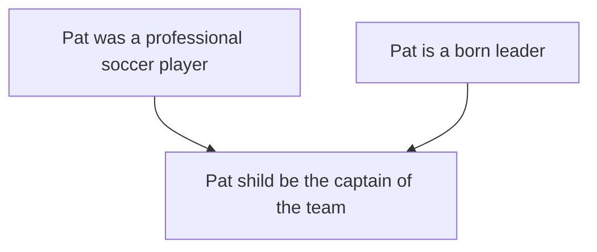
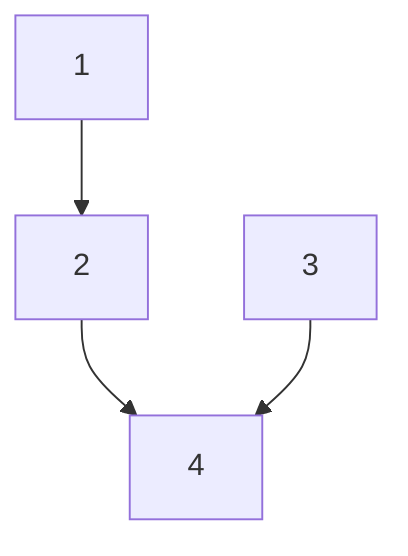
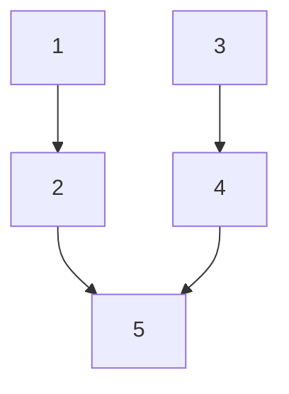
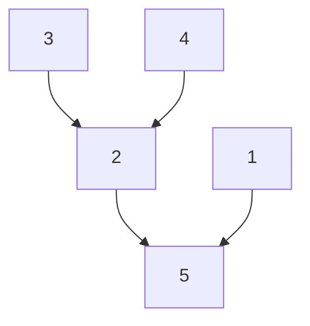
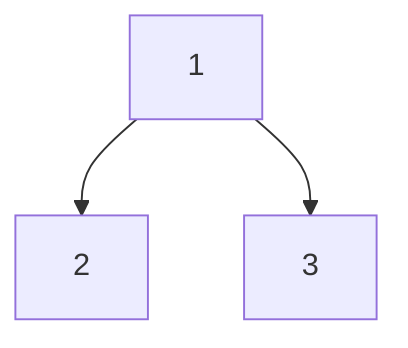
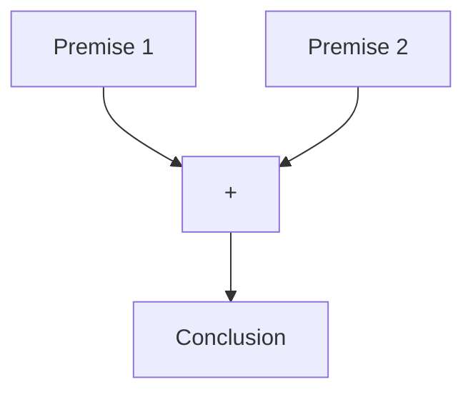

1.  [Introduction](#introduction)
2.  [Standardizing an argument](#standardizing-an-argument)
3.  [Subarguments](#subarguments)
4.  [Kinds of premises](#kinds-of-premises)
5.  [Location, Scope, and Commitment]()
6.  [Unstated Premises and Conclusions]()
7.  [Assumptions and Presuppositions]()
8.  [Conclusion]()

## 
Introduction
Once you can recognize an argument there are some things you need to be able to do before you can evaluate it. To evaluate an argument one requires an understanding of the logical structure of the argument. To see this structure one must be able to identify the premises and conclusions and show how they are related to one another. That is, which premises support which claims. This is what is called standardizing an argument. Doing this is helpful because once we can clearly see which premises support which conclusions, we are in a better position to evaluate the argument. Think of it this way. If I build a mousetrap you cannot say whether it is a good or a bad mousetrap or offer ways to improve the design unless you have some understanding of how my mousetrap works. Similarly, unless you understand how someone's argument works, you cannot offer a useful criticism of that argument.  

---

## 
Standardizing an argument
### -  Identify the conclusion
        1.  Look for indicator words
        2.  Conclusion is usually main point of passage
        3.  Conclusions usually appear at beginning or end of paragraph
>### **Example**: _Philosophy is one of the best subjects one can study at university because it teaches you how to think clearly._
        Conclusion:
            -   Philosophy teaches you how to think critically
        Indicator word:
            -   because, associated with premises

### Standardization:
    1.  Philosophy teaches you how to think critically.
    Therefore,
    2.  Philosophy is one of the best subjects one can study at university.

>### **Example**: _Since Pat was a professional soccer player, and since she is a born leader, she should be the captain of the team._
        Conclusion:
            -   Pat should be the captain of the team
        Indicator word:
            -   Since
        Premises:
            -   Professional soccer player
            -   Born leader
            
### Standardization:
    1.  Pat was a professional soccer player
    2.  Pat is a born leader
    Therefore,
    Pat should be the captain of the team

---
## 
Subarguments
> ### A subargument is a subordinate argument that is a component of a larger argument, which can be called the whole argument.

### **Example**:
    1.  When lost in the woods with her friends she took charge and kept everyone calm until the park rangers found them.
    2.  Pat is a born leader
    3.  Pat was a professional soccer player
    Therefore,
    4.  Pat should be captain of the team

### Strengthened:
    1.  When lost in the woods with her friends she took charge and kept everyone calm until the park rangers found them.
    2.  Pat is a born leader
    3.  Pat played for a team in the Brazilian Women’s Professional Soccer League.
    4.  Pat was a professional soccer player
    Therefore,
    5.  Pat should be captain of the team

### **Example**, more complicated: _Boston is a more interesting city than Toronto. It has more interesting architecture and there is more to do in the Boston area. There are many terrific shops and beautiful places to visit nearby._
    1.  Has more interesting architecture
    2.  More to do in Boston area
    3.  Many terrific shops
    4.  Beautiful places to visit nearby
    Therefore,
    5.  Boston is more interesting than Toronto

### **Example**: _Because climate change is an immediate threat, Canadians need to decrease our use of fossil fuels and we need to ensure that multinational organizations cooperate in creating standard rules for responding to the threat._
    1.  Canadians need to decrease our use of fossil fuels
    2.  Need to ensure that multinational organizations cooperate in creating standard rules for responding to the threat
    Therefore,
    3.  Climate change is an immediate threat

### The example above is an example of a divergent argument.
-   One where the same premise leads to two conclusions

---
## 
Kinds of premises
### Convergent premises
-   Work independently to support the conclusion

**Independent support** means that a convergent premise supports it's conclusion without requiring the truth of other premises.

### Linked premises
-   Independent and must work together to support the conclusion

### **Example**: _Either we go to the movie or we go out for dinner. We can't afford to go to dinner, so we should go to the movie. We don't have much cash because we don't get paid until next week._
    1.  Don't get paid until next week
    2.  Don't have much cash
    3.  Can't afford dinner
    4.  Either go to movie or go out for dinner
    Therefore,
    5. We should go to the movie

### Test your knowledge

    

        Every event must have a cause. And yet the series of causes must stop somewhere. It cannot go back to infinity. Therefore, there must be a First Cause, which is God.
    

    

    

        1.  Every event must have a cause 
        2.  It cannot go back to infinity  
        3.  Series of causes must stop somewhere 
        Therefore, 
        4.  There must be a first cause, which is God
    

 

    

        Either the butler committed the murder or the judge committed the murder. Since the butler was passionately in love with the victim, it was not he who committed the murder. Therefore, the judge committed the murder.
    

    

    

        1. Either butler committed the murder of the judge committed the murder 
        2. The butler was passionately in love with the victim 
        3. It was not the butler who committed the murder 
        4. Therefore the judge committed the murder
        
    

 

    

        Since we are not under an obligation to give aid unless aid is likely to be effective in reducing starvation and malnutrition, we are not under an obligation to give aid to countries that make no effort to reduce the rate of population growth that will lead to catastrophe.
    

    

    

        1.  Since we are not under an obligation to give aid unless aid is likely to be effective in reducing starvation and malnutrition 
        2.  We are not under an obligation to give aid to countries that make no effort to reduce the rate of population growth that will lead to catastrophe.
    

 

    

        Of the various forms of crime, bank robbery is the most satisfactory to both the individual and society. The individual of course gets a lot of money, that goes without saying, and he benefits society by putting large amounts of cash back into circulation. The economy is stimulated, small businessmen prosper; people read about the crime with great interest, and the police have a chance to exercise their skills. Good for all.
    

    

    

        1.  Bank robbery is the most satisfactory to both individual and society
        2.  Individual makes money
        3.  Benefits society by putting large amounts of cash back into circulation
        4.  Economy is stimulated
        5.  Small businessmen prosper
        6.  People read about the crime
        7.  Police have chance to exercise their skills

        1.  Individual makes money
        2.  Benefits society by putting large amounts of cash back into circulation
        3.  Economy is stimulated, small businessmen prosper
        Therefore,
        6.  Bank robbery is the most satisfactory crime to both individual and society

    

 

    

        No one has a right to use a relatively unreliable procedure in order to decide whether to punish another. Using such a system, he is in no position to know that the other deserves punishment; hence he has no right to punish him.
    

    

    

        
    

 
