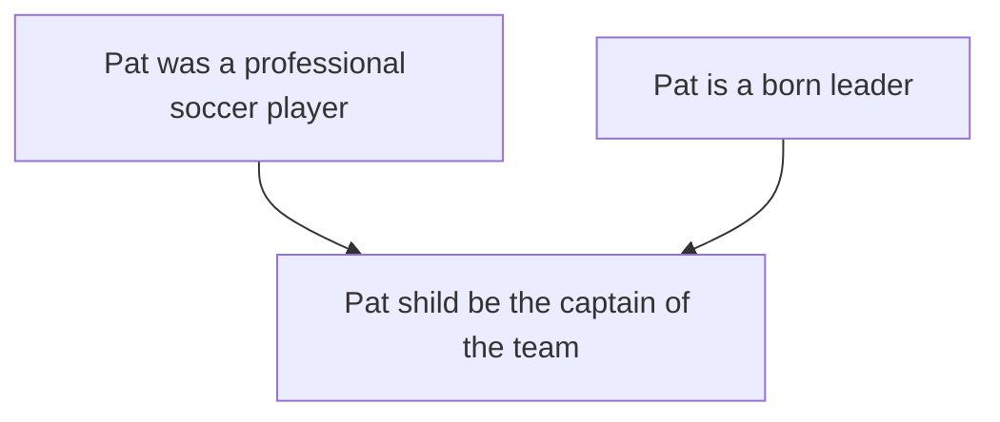
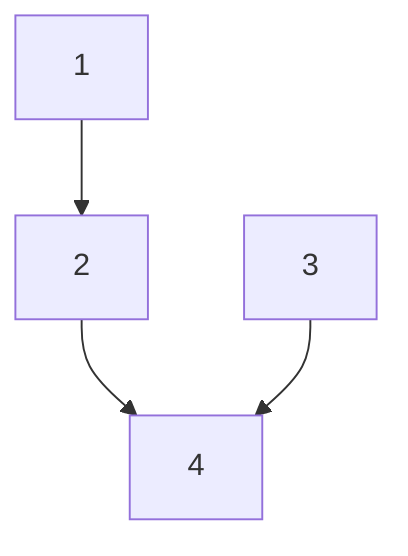
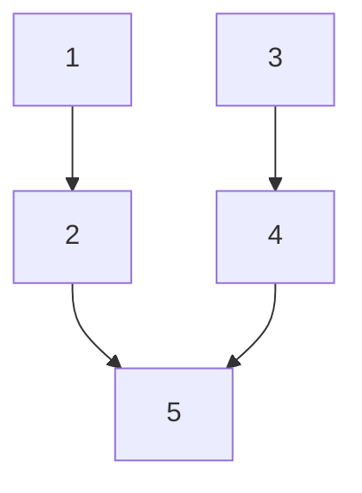
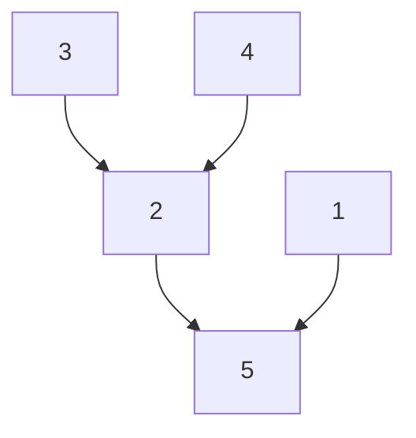
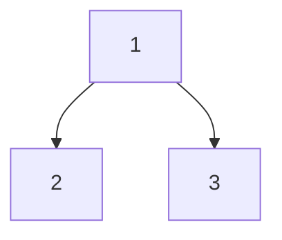
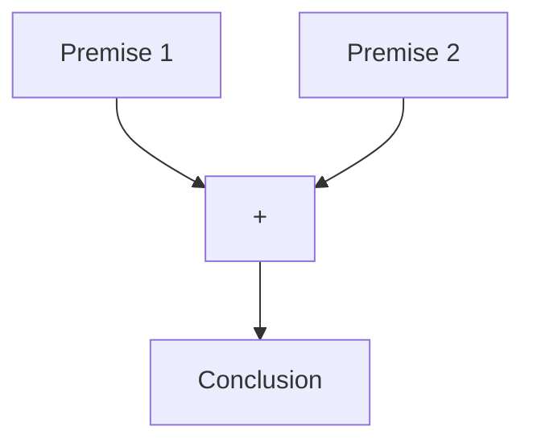
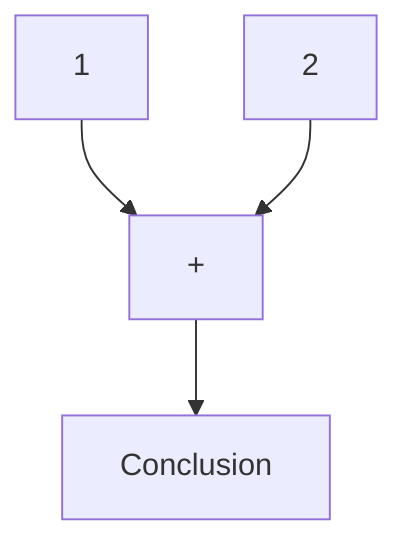

1.  [Introduction](#introduction)
2.  [Standardizing an argument](#standardizing-an-argument)
3.  [Subarguments](#subarguments)
4.  [Kinds of premises](#kinds-of-premises)
5.  [Location, Scope, and Commitment](#location-scope-and-commitment)
6.  [Unstated Premises and Conclusions]()
7.  [Assumptions and Presuppositions]()
8.  [Conclusion]()

## 
Introduction
Once you can recognize an argument there are some things you need to be able to do before you can evaluate it. To evaluate an argument one requires an understanding of the logical structure of the argument. To see this structure one must be able to identify the premises and conclusions and show how they are related to one another. That is, which premises support which claims. This is what is called standardizing an argument. Doing this is helpful because once we can clearly see which premises support which conclusions, we are in a better position to evaluate the argument. Think of it this way. If I build a mousetrap you cannot say whether it is a good or a bad mousetrap or offer ways to improve the design unless you have some understanding of how my mousetrap works. Similarly, unless you understand how someone's argument works, you cannot offer a useful criticism of that argument.  

---

## 
Standardizing an argument
### -  Identify the conclusion
        1.  Look for indicator words
        2.  Conclusion is usually main point of passage
        3.  Conclusions usually appear at beginning or end of paragraph
>### **Example**: _Philosophy is one of the best subjects one can study at university because it teaches you how to think clearly._
        Conclusion:
            -   Philosophy teaches you how to think critically
        Indicator word:
            -   because, associated with premises

### Standardization:
    1.  Philosophy teaches you how to think critically.
    Therefore,
    2.  Philosophy is one of the best subjects one can study at university.

>### **Example**: _Since Pat was a professional soccer player, and since she is a born leader, she should be the captain of the team._
        Conclusion:
            -   Pat should be the captain of the team
        Indicator word:
            -   Since
        Premises:
            -   Professional soccer player
            -   Born leader
            
### Standardization:
    1.  Pat was a professional soccer player
    2.  Pat is a born leader
    Therefore,
    Pat should be the captain of the team

---
## 
Subarguments
> ### A subargument is a subordinate argument that is a component of a larger argument, which can be called the whole argument.

### **Example**:
    1.  When lost in the woods with her friends she took charge and kept everyone calm until the park rangers found them.
    2.  Pat is a born leader
    3.  Pat was a professional soccer player
    Therefore,
    4.  Pat should be captain of the team

### Strengthened:
    1.  When lost in the woods with her friends she took charge and kept everyone calm until the park rangers found them.
    2.  Pat is a born leader
    3.  Pat played for a team in the Brazilian Women’s Professional Soccer League.
    4.  Pat was a professional soccer player
    Therefore,
    5.  Pat should be captain of the team

### **Example**, more complicated: _Boston is a more interesting city than Toronto. It has more interesting architecture and there is more to do in the Boston area. There are many terrific shops and beautiful places to visit nearby._
    1.  Has more interesting architecture
    2.  More to do in Boston area
    3.  Many terrific shops
    4.  Beautiful places to visit nearby
    Therefore,
    5.  Boston is more interesting than Toronto

### **Example**: _Because climate change is an immediate threat, Canadians need to decrease our use of fossil fuels and we need to ensure that multinational organizations cooperate in creating standard rules for responding to the threat._
    1.  Canadians need to decrease our use of fossil fuels
    2.  Need to ensure that multinational organizations cooperate in creating standard rules for responding to the threat
    Therefore,
    3.  Climate change is an immediate threat

### The example above is an example of a divergent argument.
-   One where the same premise leads to two conclusions

---
## 
Kinds of premises
### Convergent premises
-   Work independently to support the conclusion

**Independent support** means that a convergent premise supports it's conclusion without requiring the truth of other premises.

### Linked premises
-   Interdependent and must work together to support the conclusion

### **Example**: _Either we go to the movie or we go out for dinner. We can't afford to go to dinner, so we should go to the movie. We don't have much cash because we don't get paid until next week._
    1.  Don't get paid until next week
    2.  Don't have much cash
    3.  Can't afford dinner
    4.  Either go to movie or go out for dinner
    Therefore,
    5. We should go to the movie

### Test your knowledge

    

        Every event must have a cause. And yet the series of causes must stop somewhere. It cannot go back to infinity. Therefore, there must be a First Cause, which is God.
    

    

    

        1.  Every event must have a cause 
        2.  It cannot go back to infinity  
        3.  Series of causes must stop somewhere 
        Therefore, 
        4.  There must be a first cause, which is God
    

 

    

        Either the butler committed the murder or the judge committed the murder. Since the butler was passionately in love with the victim, it was not he who committed the murder. Therefore, the judge committed the murder.
    

    

    

        1. Either butler committed the murder of the judge committed the murder 
        2. The butler was passionately in love with the victim 
        3. It was not the butler who committed the murder 
        4. Therefore the judge committed the murder
        
    

 

    

        Since we are not under an obligation to give aid unless aid is likely to be effective in reducing starvation and malnutrition, we are not under an obligation to give aid to countries that make no effort to reduce the rate of population growth that will lead to catastrophe.
    

    

    

        1.  Since we are not under an obligation to give aid unless aid is likely to be effective in reducing starvation and malnutrition 
        2.  We are not under an obligation to give aid to countries that make no effort to reduce the rate of population growth that will lead to catastrophe.
    

 

    

        Of the various forms of crime, bank robbery is the most satisfactory to both the individual and society. The individual of course gets a lot of money, that goes without saying, and he benefits society by putting large amounts of cash back into circulation. The economy is stimulated, small businessmen prosper; people read about the crime with great interest, and the police have a chance to exercise their skills. Good for all.
    

    

    

        1.  Bank robbery is the most satisfactory to both individual and society
        2.  Individual makes money
        3.  Benefits society by putting large amounts of cash back into circulation
        4.  Economy is stimulated
        5.  Small businessmen prosper
        6.  People read about the crime
        7.  Police have chance to exercise their skills

        1.  Individual makes money
        2.  Benefits society by putting large amounts of cash back into circulation
        3.  Economy is stimulated, small businessmen prosper
        Therefore,
        6.  Bank robbery is the most satisfactory crime to both individual and society

    

 

    

        No one has a right to use a relatively unreliable procedure in order to decide whether to punish another. Using such a system, he is in no position to know that the other deserves punishment; hence he has no right to punish him.
    

    

    

        
    

 

---

## 
Location, Scope, and Commitment
### Location
A conclusion can appear anywhere in an argument, arguments can be long and lengthy such as a book. Therefore, it is not always easy to locate an argument. Sometimes, instead of stating an argument, an author or speaker may ask a rhetorical question.

> A **Rhetorical Question** is one the speaker or the author knows the answer to, and in the case of arguments may be used instead of assertating the conclusion

Rhetorical questions can also be used in place of premises.

### **Example**: “Are we a nation that tolerates the hypocrisy of a system where workers who pick our fruit and make our beds never have a chance to get right with the law? Are we a nation that accepts the cruelty of ripping children from their parents' arms? Or are we a nation that values families, and works to keep them together?” — Barack Obama, 20 November, 2014

Obama continues with a conclusion: “We need more than politics as usual when it comes to immigration. We need reasoned, thoughtful, compassionate debate that focuses on our hopes, not our fears.”

### Scope
> ### Scope of a premise or conclusion refers to how many members of a group the claim is to apply

We want our scope of our conclusion to match the scope of our premises.

### **Example**: If we claim that some dance students have a good sense of rhythm, then we cannot conclude that all dance students have a good sense of rhythm

### Counter-example
> ### A counter-example is a case or instance that defeats by condradicting a universal claim

### Commitment
> ### The degree or commitment to a conclusion indicates how certain the author or speaker is of the conclusion they are making

### **Example**: The Upshot’s elections model suggests that Hillary Clinton is favored to win the presidency, based on the latest state and national polls. A victory by Mr. Trump remains possible: Mrs. Clinton’s chance of losing is about the same as the probability that an N.F.L. kicker misses a 37-yard field goal. —New York Times, 8 November, 2016

The above is an example of a qualified or tentative conclusion

---

## 
Unstated Premises and Conclusions
> ### Often arguments have missing or unstated premises, conclusions or both
>   1.  The speaker asks a rhetorical question/
>   2.  The speaker has simply failed to make all the premises explicit.

### **Example**: You shouldn't eat that whopper. What about your diet?

The premises used to support the conclusion are implied but not explicit. One premise is 
    1.  You are on a diet

A second premise might be
    1.  Each whopper contains 42 grams of fat

This argument can be rephrased to: ***Since you are on a diet and each Whopper contains 42 grams of fat, you shouldn't eat that Whopper.***

A standardization of this argument might be:
    1.  You are on a diet.
    2.  Each whopper ontains 42 grams of fat
    Therefore.
    3.  You shouldn't eat that whopper.

> Other times we can't ask the speaker to give us more information (perhaps you are reading an article). In such cases we must fill in the missing premises ourselves. On occasions like this we must use the principle of charity.

    1.  The added premises must help make the argument as strong as possible.
    2.  We should not attribute to the speaker claims that are too strong to be plausible.
    3.  Strike a balance between these two guidelines.

### **Example**: High crime rates are caused by the widespread use of probation and suspended sentences. Therefore, we should amend the Criminal Law to provide for mandatory prison sentences for all crimes.

Conclusion: we should amend the criminal law to provide for mandatory prison sentences for all crimes.

Premise 1: high crime rates are caused by the widespread use of probation and suspended sentences.

Two arguments we could make here would be:
    1.  A policy of mandatory prison sentences for all crimes will lead to a reduction in crime rates.
    2.  A policy of mandatory prison sentences for all crimes is likely to lead to a reduction in crime rates.  

1 is too strong because it implies that a definite result will be produced. 2 states that a certain result is likely but offers no gurantee. Claims about what will happen are more plausible if they are qualified to say what will probably happen.

    1.  A police of mandatory prison sentences for all crimes is likely to lead to a reduction in crime rates
    2.  High crime rates are caused by the widespread use of probation and suspended sentences
    Therefore,
    3.  We should amend the criminal law to provide for mandatory prison sentences for all crimes
    4.  
---

## 
Assumptions and Presuppositions
> ### Assumptions and presuppositions are premises that are not stated but are assumed by the speaker.

### **Example**: Philosophers make the best lovers because being attentive to one's partner is essential to being a good lover.

    1.  Philosophers tend to be attentive people
    2.  Being attentive to one's partner is essential to being a good lover
    Therefore,
    3.  Philosophers make the best lovers

### Test your knowledge
    For the following examples, 
    a) rewrite them in standardized form with the premises preceding the conclusion, 
    b) number the premises and conclusions, 
    c) add any missing premises or conclusions, 
    d) indicate any subarguments, and 
    e) diagram the whole argument.

    

        If people were truly unselfish, they would give as much to worthy charities as they save for their old age. But do they? You tell me!
    

    

    

        1.  If people were truly unselfish, they would give as much to worthy charities as they save for their old age. 
        2.  People don't give as much to charities as they save for their old age (missing premise) 
        Therefore, 
        3.  People are selfish (missing conclusion)

 

    

        Background: The following are comments about the use of pictures, as contrasted with statements.
        Logicians tell us …that the terms “true” and “false” can only be applied to statements, propositions. And whatever may be the usage of critical parlance, a picture is never a statement in that sense of the term. It can no more be true or false than a statement can be blue or green.
    

    

    

        1.  True and false can only be applied to statements and propositions 
        2.  A picture is never a statement 
        Therefore, 
        3.  A picture can never be true or false

 

    

        Photographs can be altered and the techniques for doing so are increasingly sophisticated, due to the use of computers. You can see a man and his children in a picture, with no wife beside him, and yet in the original picture his wife (whom he has now divorced) was there. He had her eliminated with sophisticated alteration techniques. You can see from this that photographs are not a reliable guide to what reality was like in the past.
    

    

    

        1.  Photographs can be altered and the techniques for doing so are increasingly sophisticated, due to the use of computers. 
        2.  A man  had a picture of him and his wife 
        3.  He had her eliminated from the photo with sophisticated alteration techniques   
        Therefore, 
        4.  Photographs are not a reliable guide to what reality was like in the past.

 

    

        We all hope to grow old someday, and when we grow old, we will need the services of retailers, manufacturers, politicians, dentists, doctors, nurses, and many other personnel. These people will provide us with what we need, and they will help to care for us. Who will they be? Only a few, if any, will be our own children. The rest will be other people’s children. Thus, we all have a personal stake in educating other people’s children. Anyone who says, “I am willing to pay to educate my own children, but not other people’s children” is making a serious mistake.
    

    

    

        1.  We all hope to grow old someday, and when we grow old, we will need the services of retailers, manufacturers, politicians, dentists, doctors, nurses, and many other personnel. 
        2.   These people will provide us with what we need, and they will help to care for us. 
        3.  Only a few, if any, will be our own children. 
        4.  The rest will be other people’s children. 
        Therefore, 
        5.  Anyone who says, “I am willing to pay to educate my own children, but not other people’s children” is making a serious mistake.

 

    

        Since watching the news and reading the news are both elements in the same syndrome, it is hardly surprising that TV news viewing is positively associated with civic involvement. Those of us who rely solely on TV news are not quite as civic in our behaviour as our fellow citizens who rely on newspapers, we news watchers are nevertheless more civic than other Americans. Regular viewers of network newscasts…spend more time on community projects, attend more club meetings, and follow politics more closely than other Americans.
    

    

    

        1.  Watching the news and reading the news are both elements in the same syndrome. 
        2.  Reading the news is positively associated with civic involvement. [missing premise] 
        Therefore, 
        3.  TV news viewing is positively associated with civic involvement.  
        4.  Those of us who rely solely on TV news are not quite as civic in our behaviour as our fellow citizens who rely on newspapers. 
        5.  Regular viewers of network newscasts…spend more time on community projects, attend more club meetings, and follow politics more closely than other Americans. 
        Therefore, 
        6.  Those of us who rely solely on TV news are more civic than other Americans. 

 

 

---

## 
Conclusion
The first two chapters of Govier’s book have focussed on understanding what arguments are, what they look like (how to identify them), and the structure of simple and more complex arguments. Arguments, or course, can be much more complex than the short examples we have considered. Consider a whole book that carefully develops one argument through the whole book—each chapter might construct a subargument and each subargument fits together to make the case of a larger main argument. And in each chapter there could be further subarguments that support the chapter’s main subargument. You may also think about how a lawyer may construct an argument to prove the guilt of someone on trial. Parts of the argument conclude the accused had motivation, other parts conclude opportunity, and other parts ability. Taken altogether the lawyer hopes we are convinced the accused is guilty.